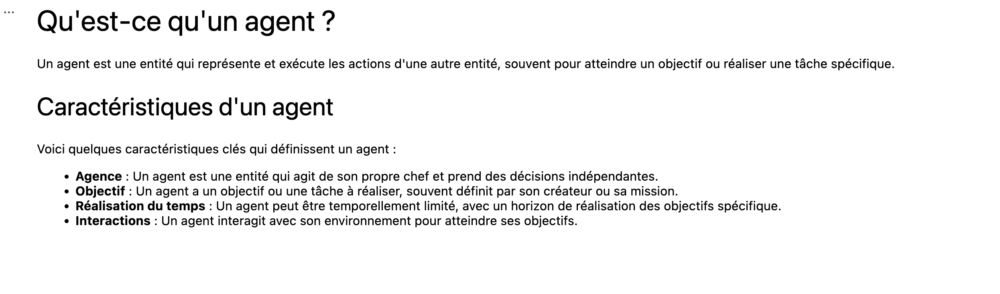

#  TP I - PROMPT ENGINEERING  : Prof SARA RETAL

Ce TP  démontre l'utilisation d'un LLM dans notre projet personnel

## Prerequis communs
- sys : pour vérifier que python est installé et  l'environnement virtuelle activée
- tiktoken : bibliothèque pour la tokenisation
- langchain_ollama : Large Language Model *(LLM)*
- IPython.display

## Question à l'agent et Réponse de ce dernier

